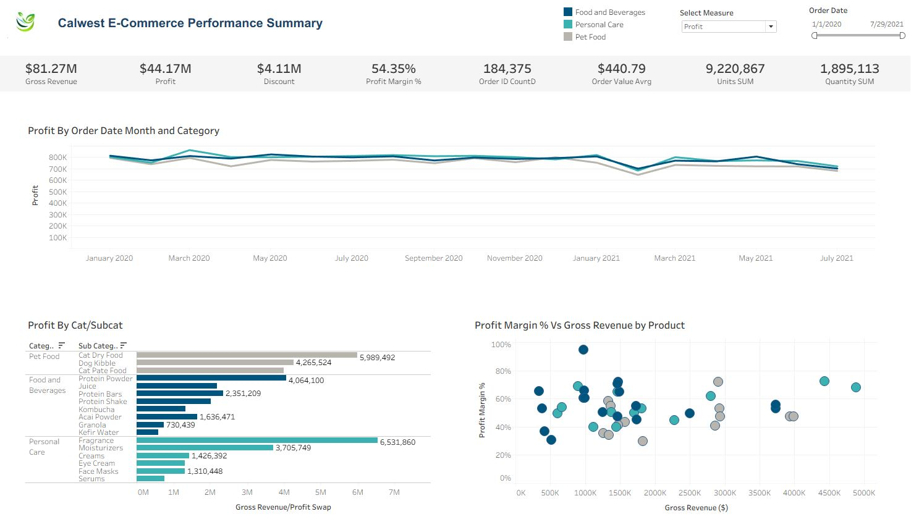
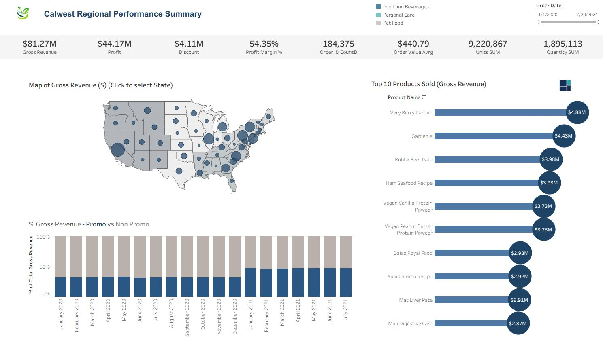

## Project Summary
Calwest E-Commerce is an e-commerce company selling health-conscious products for people and their pets. This project includes two interactive Tableau dashboards designed to summarize **high-level company performance** and **regional performance**. The dashboards were created with best practices in dashboard design, branding and interactivity. This project was developed as part of the CFI Business Intelligence & Data Analysis (BIDA) Tableau case study course.

---

## Project Structure
The project can be divided into four main sections:  
1. **Create the data model**  
2. **Dashboard 1: E-commerce Performance Summary**  
3. **Dashboard 2: Regional Performance Summary**  
4. **Add interactivity to dashboards**  

---

## Dashboard 1: Performance Summary

**High-Level Metrics (BANS visual)**  
- Display all key metrics except Count of Customers and Row Level Profit  

**Visuals:**  
- **Line Chart:** Gross Revenue by Order Month (one line per Category, colored consistently)  
- **Bar Chart:** Gross Revenue by Category/SubCategory (matching colors)  
- **Scatter Chart:** Gross Revenue vs Profit Margin % by Product (matching colors)  

**Dashboard Design:**  
- Floating layout (1500 x 900 suggested)  
- Order date filter to make visuals responsive  
- Titles, headings, and tooltips for clarity  
- Calwest branding using the company logo  
- Best practices applied for layout and formatting  

**Screenshot:**  

  

---

## Dashboard 2: Regional Performance Summary

**Visuals:**  
- **Map:** US states by region, showing gross revenue  
- **Bar Chart:** % of gross revenue from promotions vs non-promotions per month  
- **Tree Map:** Category > SubCategory with gross revenue and profit margin % labeling  
- **Lollipop Chart:** Top 10 products by Gross Revenue  

**Dashboard Design:**  
- Floating layout (1500 x 900 suggested)  
- Replicate header area from Dashboard 1 (titles, order date slicers, KPIs)  
- Floating container to show/hide lollipop chart  
- Tooltips, clear titles, and Calwest branding  
- Order date filter to ensure interactivity  

**Screenshot:**  

  

---

## User Interaction Features
- Order date filters (all dashboards)  
- Show/hide charts (floating containers)  
- Responsive visuals and interactive tooltips  

---

## View Dashboards
You can explore the visuals and interactive dashboards on **Tableau Public**:  
[Open in Tableau Public](https://public.tableau.com/views/CalwestE-CommerceProject/PerformanceDashboard?:language=es-ES&:sid=&:redirect=auth&:display_count=n&:origin=viz_share_link)

